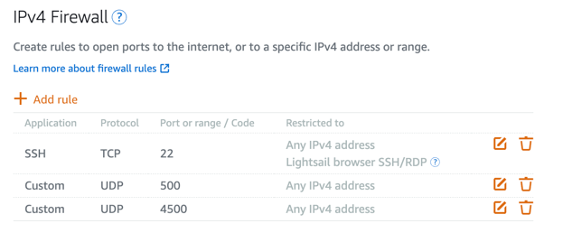

## configure iptables
- clear all rules
  ```bash
  iptables -P INPUT ACCEPT
  iptables -P FORWARD ACCEPT
  iptables -P OUTPUT ACCEPT
  iptables -t nat -F
  iptables -t mangle -F
  iptables -F
  iptables -X
  ```
- open ssh access
  ```bash
  iptables -A INPUT -m state --state ESTABLISHED,RELATED -j ACCEPT
  iptables -A INPUT -p tcp --dport 22 -j ACCEPT
  ```
- permit loopback
  ```bash
  iptables -A INPUT -i lo -j ACCEPT
  ```
- open 4500 and 500 ports for udp
  ```bash
  iptables -A INPUT -p udp --dport  500 -j ACCEPT
  iptables -A INPUT -p udp --dport 4500 -j ACCEPT
  ```
- permit ESP traffic forwarding. do not change 10.10.10.0/24.
  ```bash
  iptables -A FORWARD --match policy --pol ipsec --dir in  --proto esp -s 10.10.10.0/24 -j ACCEPT
  iptables -A FORWARD --match policy --pol ipsec --dir out --proto esp -d 10.10.10.0/24 -j ACCEPT
  ```
- apply MASQUERADING.
  check network interface.
  ```bash
  ifconfig -a | grep flags
  ```
  Output should be like
  ```text
  eth0: flags=4163<UP,BROADCAST,RUNNING,MULTICAST>  mtu 1500
  lo: flags=73<UP,LOOPBACK,RUNNING>  mtu 65536
  ```
  In this output the interface is 'eth0' but it could differ in your case. Replace \<interface> with your output and execute next command
  ```bash
  iptables -t nat -A POSTROUTING -s 10.10.10.0/24 -o <interface> -m policy --pol ipsec --dir out -j ACCEPT
  iptables -t nat -A POSTROUTING -s 10.10.10.0/24 -o <interface> -j MASQUERADE
  ```
  (DO NOT COPY) For example
  ```bash
  iptables -t nat -A POSTROUTING -s 10.10.10.0/24 -o eth0 -m policy --pol ipsec --dir out -j ACCEPT
  iptables -t nat -A POSTROUTING -s 10.10.10.0/24 -o eth0 -j MASQUERADE
  ```
  Set the max segment of the packets. Replace \<interface> and execute next command
  ```bash
  iptables -t mangle -A FORWARD --match policy --pol ipsec --dir in -s 10.10.10.0/24 -o <interface> -p tcp -m tcp --tcp-flags SYN,RST SYN -m tcpmss --mss 1361:1536 -j TCPMSS --set-mss 1360
  ```
- restrict other connections
  ```bash
  iptables -A INPUT -j DROP
  iptables -A FORWARD -j DROP
  ```  
- save netfilter rule sets
  ```bash
  netfilter-persistent save
  netfilter-persistent reload
  ```
- reboot
  ```bash
  reboot
  ```
- become sudo and check the rules
  ```bash
  sudo -i
  iptables -S
  ```
  Output example
  ```text
  -P INPUT ACCEPT
  -P FORWARD ACCEPT
  -P OUTPUT ACCEPT
  -A INPUT -m state --state RELATED,ESTABLISHED -j ACCEPT
  -A INPUT -p tcp -m tcp --dport 22 -j ACCEPT
   -A INPUT -i lo -j ACCEPT
  -A INPUT -p udp -m udp --dport 500 -j ACCEPT
  -A INPUT -p udp -m udp --dport 4500 -j ACCEPT
  -A INPUT -j DROP
  -A FORWARD -s 10.10.10.0/24 -m policy --dir in --pol ipsec --proto esp -j ACCEPT
  -A FORWARD -d 10.10.10.0/24 -m policy --dir out --pol ipsec --proto esp -j ACCEPT
  -A FORWARD -j DROP
  ```
- if your machine is in cloud than check that ports 500 and 4500 are open. AWS example
  
